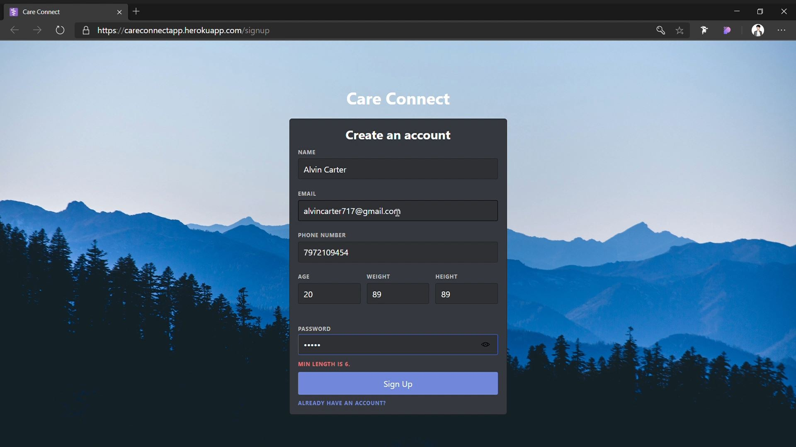
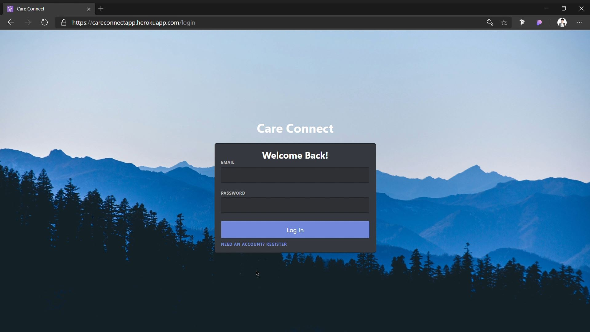
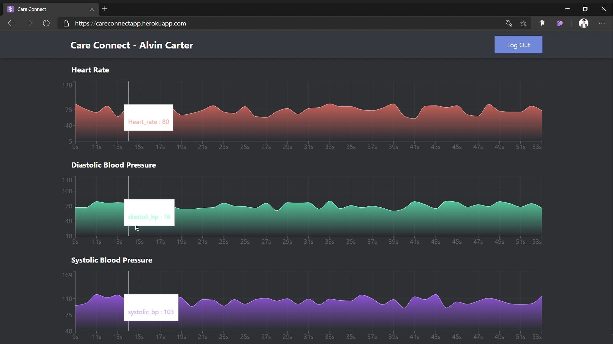

<h1 align="center">
🌐 Care Connect
</h1>
<p align="center">
MongoDB, Expressjs, React, Nodejs
</p>

> MERN is a fullstack implementation in MongoDB, Expressjs, React, Nodejs,
> SocketIO

MERN stack is the idea of using TypeScript/Node for fullstack web development.

## Tech Stack

- Typescript
- MongoDB
- React
- Express
- NodeJS
- Socketio
- RESTFUL API's
- Heroku
- YARN
- Postman

## clone or download

```terminal
$ git clone https://github.com/smitbarmase/care-connect.git
$ yarn install
```

## project structure

```terminal
client/
   public/
   src/
   .gitignore
   package.json
   readme.md
   tsconfig.json
   yarn.lock
dist/
screentshots/
ml-model/
src/
   auth/
   models/
   routes/
   index.ts
.gitignore
LICENSE
package.json
readme.md
tsconfig.json
yarn.lock
...
```

# Usage (run fullstack app on your machine)

## Prerequirements

- [MongoDB](https://www.mongodb.com/)
- [Node](https://nodejs.org/en/) ^10.0.0
- [yarn](https://yarnpkg.com/)

notice, you need client and server runs concurrently in different terminal
session, in order to make them talk to each other

## Client-side usage(PORT: 3000)

```terminal
$ cd client   // go to client folder
$ yarn install     // yarn install pacakges
$ yarn start // run it locally

// deployment for client app
$ yarn run build // this will compile the react code using webpack and generate a folder called docs in the root level
$ yarn run start // this will run the files in docs, this behavior is exactly the same how gh-pages will run your static site
```

## Server-side usage(PORT: 4000)

```terminal
$ cd server   // go to server folder
$ yarn install   // yarn install pacakges
$ yarn start // run it locally
```

## Deploy Server to [careconnectapp.herokuapp.com](https://careconnectapp.herokuapp.com/)

```terminal
$ yarn i -g heroku
$ heroku login
...
$ heroku create
$ yarn run heroku:add <your-super-amazing-heroku-app>
// remember to run this command in the root level, not the server level, so if you follow the documentation along, you may need to do `cd ..`
$ pwd
/Users/<your-name>/mern
$ yarn run deploy:heroku
```

# Dependencies(tech-stacks)

| Client-side                   | Server-side              |
| ----------------------------- | ------------------------ |
| axios: ^0.15.3                | "bcrypt": "^5.0.0"       |
| react-hook-form": "^6.9.2"    | "body-parser": "^1.19.0" |
| styled-components": "^5.2.0"  | "express": "^4.17.1"     |
| react: ^16.2.0                | "jsonwebtoken": "^8.5.1" |
| react-dom: ^16.2.0            | "mongoose": "^5.10.7"    |
| recharts": "^1.8.5"           | "morgan": "^1.10.0"      |
| react-router-dom: ^4.2.2      | "socket .io": "^2.3.0"   |
| socketio-client: "^2.3.1"     | "concurrently": "^5.3.0" |
| "typescript": "^4.0.3"        | "typescript": "^4.0.3"   |

# Screenshots of this project

## Signup Page



## Login Page



## Home Page


